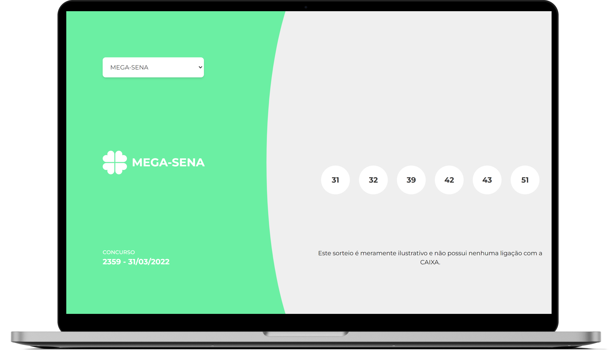
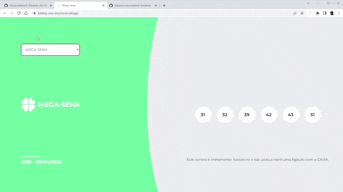

<h1 align="center">
  </img>
</h1>

<p align="center">
  <a href="#ℹ-descrição">Descrição</a> •
  <a href="#-tecnologias">Tecnologias</a> •
  <a href="#-pré-requisitos">Pré-requisitos</a> •
  <a href="#-como-usar">Como usar</a> •
  <a href="#-demonstração">Demonstração</a>
</p>

<p align="center">
  </img>
</p>

<p align="center">
  
  
  
</p>

## ℹ Descrição

Projeto desenvolvido como [desafio da Brainn Co. para função de Dev front-end](https://github.com/brainnco-exs/readme-frontend). 🧠🚀

O desafio consistia em desenvolver uma aplicação web front-end que mostre os resultados das loterias.

O layout da aplicação foi feita conforme o [design do Figma](https://www.figma.com/file/H2qrYBCFMf4didYmxRwTxP/Brainn-Frontend-Challenge), e os resultados das loterias é obtida usando a [API REST desenvolvida por eles](https://brainn-api-loterias.herokuapp.com/).

### 🏹 O que foi cumprido do esperado

- Suporte para 6 sorteios: `Mega-sena`, `Quina`, `Lotofácil`, `Lotomania`, `Timemania` e `Dia de sorte`;
- Ao escolher um sorteiro, mudar o tema do sorteio, número do sorteio, data do sorteio e números sorteados;
- Responsividade para celulares, conforme layout;
- Consumo da API via REST ou GraphQL;
- Rotas com React Router DOM (feito com SvelteKit).

### 🎯 O que foi feito além do esperado

- Animações ao mostrar resultado de um sorteio;
- Cache dos resultados dos sorteios em local storage para evitar repetição de requests.

## ⚒ Tecnologias

### O que era esperado

- React com TypeScript
- Testes com React Testing Library e/ou Cypress

### O que foi utilizado

- [**Svelte**](https://svelte.dev/) com [**Typescript**](https://www.typescriptlang.org)
- [**SvelteKit**](https://kit.svelte.dev/)
- [**TailwindCSS**](https://tailwindcss.com/)
- [**Jest**](https://jestjs.io/pt-BR/)
- [**React Testing Library**](https://testing-library.com/)

  \*_Obs.: Svelte com SvelteKit seria o equivalente de ReactJS com Next.js. SvelteKit cuida da parte do servidor e SSR/SSG, e Svelte renderização._

## ⚙ Pré-requisitos

- [Git](https://git-scm.com)
- [Yarn](https://yarnpkg.com)
- Editor de código.

## 🖥 Como usar

**Clone o projeto e acesse a pasta**

```bash
$ git clone https://github.com/EduardoReisUX/lottery.git && cd lottery
```

**Siga os passos seguintes**

```bash
# Instale as dependências
$ yarn

# Verifique os testes unitários
$ yarn test
# ou
$ yarn test:watch

# Inicie a aplicação na sua máquina
$ yarn dev
```

## 👀 Demonstração

<p align="center">
  </img>
</p>

---

<p align="center">Feito com 💜 por <a href="https://github.com/EduardoReisUX">Eduardo dos Reis</a></p>
